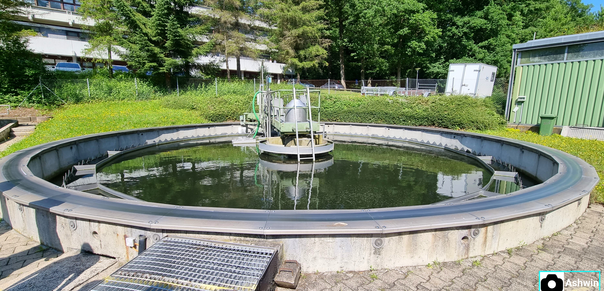

# Prediction model for WWTP parameters (GUI)


*<sub>Institute of Sanitary Engineering, Water Quality and Waste Management (ISWA),Bandtäle 2, 70569 Stuttgart-Büsnau (Source: Ashwin Vijaya Kumar, 2021).</sub>*

***

> ***Motivation***: The rapid urbanization and the increasing wastewater discharge demands improving the efficiency of wastewater treatment plants (WWTP).This can help reduce operating costs and helps towards sustainable goals. Machine learning is considered the latest solution for exploring the possibilities of improving WWTP operating status in future period by modelling. The primary indicators that affects the WWTP's efficiency are influent Chemical oxygen demand (COD), Nitrate concentration etc. Predicting the COD values can give us an idea about the energy consumption of the WWTP.  

> ***Objective***: To predict COD parameter of WWTP using random forest model, display plot of recorded and predicted values using a GUI. 

> ***Python libraries***: pandas, matplotlib, tkinter, sklearn

Web URL to our Git Repository
```
https://github.com/IamAshwinVKumar/MOAV_Python_Project_S22.git
```
## Theory: Random Forest model (RF) 
Leo Breiman and Adele Cutler are the creators of the widely used machine learning technique known as random forest, which mixes the output of various decision trees to produce a single outcome. Its widespread use is motivated by its adaptability and usability because it can solve classification and [regression problems](https://en.wikipedia.org/wiki/Regression_analysis).

More information on RF model can be found [here](https://towardsdatascience.com/random-forest-in-python-24d0893d51c0).
### List of files:
1. `config.py` : Used to serve as an initial setting to call all necessary libraries and global variables.
2. `Data_handling.py`: Custom class for data handling.
3. `main.py`: Script responsible for the main functions.
4. `plot.py`: Custom class to plot the recorded and predicted value of Chemical oxygen demand(COD) parameter.
5. `log_file.py`: Used for recording events in a Log file.
6. `GUI.py`: The Graphical user interface(GUI), a stand-alone script incorporating all the programs.

### Attributed folders:
1. Images
2. Project-abstract-ppt
3. WWTP-data-input
## Running Instructions:
>`GUI.py` is our stand-alone script which is programmed to incorporate all the other functions. On executing the `GUI.py` script, a window pops up which displays buttons to initiate prediction using RF model, display accuracy of the model and to plot the comparison of the recorded and predicted value. After the process the window can be closed by clicking the exit button on the bottom. 

The process flow actually involves use of `Data_handling.py` to extract the collected time series data starting from 2006 to 2021 (Source:ISWA) and combine it together. Then, the prediction model called 'Random Forest model (RF)' is used. The purpose of `main.py` is to split the combined data (output of `Data_handling.py`) into two necessary datasets for RF Model calculation: the training dataset and the test dataset. As the output of `main.py`, we are able to calculate the prediction result and the accuracy of our model. With the predicted and recorded data, `plot.py` plots a graph of the comparison of predicted and recorded values of Chemical oxygen demand(COD) parameter of the plant.

> If any difficulty faced in running the code, please check if all the libraries and packages are installed properly as per the `config.py` file and try again.
# Description of Codes
### An overview of the main components used
* ```main.py``` contains 2 functions- ```split()```,```rf_model()```
* ```Data_handling.py```contains a custom class ```DataHandler```. This class contains 2 methods.
* ```plot.py```contains a custom class ```plotting```. 
* ```GUI.py```contains a class.
* ```config.py```The project's necessary input file paths are imported together with the necessary packages and modules.
* ```log.py```contains logging configuration.

## UML Diagram
Describes the Classes and functions mentioned in the code structure. 


## Description
1. `config.py`:

This is created to import basic library and global libraries in python. It also contains the necessary libraries for the Random Forest Model (RF) Kernel.
```python
# To import basic libraries in python
import os   
import logging 
import math
    
# To import global libraries in python
import pandas as pd
import matplotlib.pyplot as plt

# To use Random Forest(RF) Model kernel (additional)
from sklearn.model_selection import train_test_split
from sklearn.ensemble import RandomForestClassifier
from sklearn import metrics
```
> Please install the aforementioned packages on the host machine if they aren't already there to make it easier to run the code.
2. `Data_handling.py`:

It contains `class DataHandler:` which is built with three functions. The purpose of `Data_Handling.py` is to manipulate the collected data, combine the sorted data and extract the file in the Excel format.

  a.`__init__(self, years):` 

_This is used for initialisation of the object such as years and path._

  b.`data_handler(self):`

_This function is for the pre-process the required data into pandas dataframe. It sorts the data by years and keep them all in one data frame._

  c. `print(self):`

_This is to create the file for the dataframe of the sorted data._

_Here is the output of the combined and sorted data_
```    
        Inflow_m³  COD_mg/l  Nitrate_mg/l  Phosphorus_mg/l
0       1581.0     231.0         24.40            3.340
1       1845.0     467.0         46.70            6.260
2       1003.0     537.0         53.20            7.020
3       1911.0     612.0         62.80            7.270
4       1622.0     593.0         62.50            8.010
..         ...       ...           ...              ...
112     1562.0     263.0         47.85            4.735
113     1358.0     501.0         49.00            5.875
114     1174.0     555.5         50.25            6.210
115     1163.0     542.0         41.40            8.415
116     2089.0     229.0         23.10            2.400

[1911 rows x 4 columns]
```
3. `main.py`:

The purpose of `main.py` is to hold all the functions implemented in the project.

Firstly, both `Data_Handling.py` and 'plot.py' are imported. If so, the file of the sorted data can be used to calculate the Random Forest Model(RF Model).

`main.py` contains two functions:

a.`def split(frame):`
_It is used to split the Pandas' data frame into two datasets: the training and test sets._

b. `def rf_model(x_train, y_train, x_test):`

_This is used to run Random Forest Model with the split datasets._

_In `main.py`, both prediction and accuracy are calculated._

4. `plot.py`:

`class plot:` is created to plot the COD parameter, both recorded and prediction.

`class plot:` includes two functions:

a.`__init__(self):`

_This is used for assigning of input values to class attributes._

b.`plotting(prediction, recorded_value):`

_This is used to plot the recorded and predicted value of Chemical oxygen demand(COD) parameter._

5. `log_file.py`:

This is used to create the log record of the project.

6. `GUI.py`:

In `GUI.py`, `class Interface(tk.Frame):` includes three methods:

Aim of the class is to describe the accuracy of the predicted model and to show the comparison of the predicted and recorded data.

a.`__init__(self, master=None):`
_This creates a tk frame. It works to create the title of the frame, the set the icon on the top and to format the box.It contains one label and three bottoms to show the description of the project working, the accuracy of the prediction and the plotting of the project._

b.`message(self, message):`
_This method is to display the message after clicking the button._

`messages(self, message):`
_This method is to display the accuracy of the RF prediction model._

c.`def plot(self):`
_This is to show the plotting of the predicted and the measured values_

***
###Inference
> _RF model trains very quickly and is easy to use compared to other regression models, but for our data of waster water its accuracy is very low. Hence, other models needs to be tested for maximum efficiency._

***
## Reference
[hydro-informatics](https://github.com/hydro-informatics/jupyter-python-course.git) I [Random Forest in Python](https://towardsdatascience.com/random-forest-in-python-24d0893d51c0) I [Random Forests Classifiers in Python](https://www.datacamp.com/tutorial/random-forests-classifier-python)
 
## Developed by 
[Ashwin Vijaya Kumar](https://github.com/IamAshwinVKumar) and [Yin Mon Aung](https://github.com/Yinmon19)
